<div align="center">

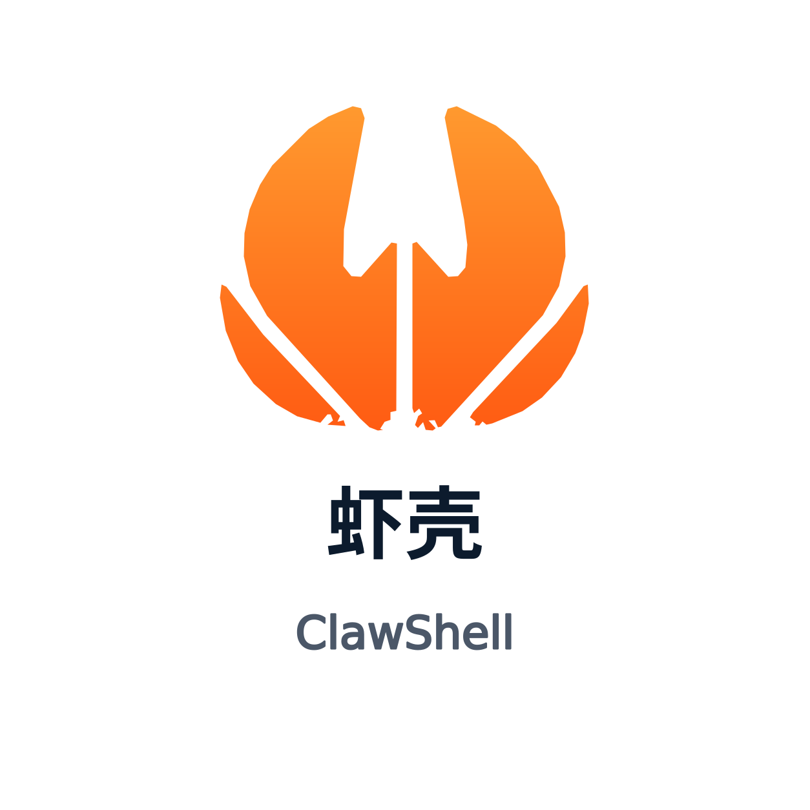

# ClawShell (虾壳)

**OpenClaw简易版桌面客户端** | **OpenClaw Simple Desktop Client**

[](LICENSE)
[]()
[]()
[]()

🌐 [官网 Website](https://www.pineapple.wang) &nbsp;|&nbsp; 📖 [文档 Docs](https://www.pineapple.wang)

[English](#-english) &nbsp;|&nbsp; [中文](#-中文)

</div>

---

## 中文

### 介绍

ClawShell（虾壳）是一款基于 [OpenClaw](https://www.npmjs.com/package/openclaw) 内核的桌面 AI 助手客户端，旨在将强大的 AI 能力带给每一位普通用户。无需命令行操作，无需技术背景，点点鼠标即可拥有自己的 AI 助手。核心亮点为可视化配置多渠道、多Agent、多模型，内置丰富的预设模板和技能商店，满足各种使用场景和个性化需求。

### ✨ 功能特性

- **智能对话** — 支持 Markdown 渲染、流式输出、工具调用展示、语音输入与朗读
- **模型配置** — 支持国内主流 AI 模型（DeepSeek、Kimi、MiniMax 等），三步完成配置
- **助手管理** — 创建自定义 AI 助手，设定性格、身份和说话风格，内置多种预设模板
- **渠道接入** — 接入 QQ、微信、飞书、钉钉、Telegram、Discord 等国内国际主流 10+ 即时通讯平台
- **技能商店** — 浏览和安装 AI 技能插件，拓展 AI 助手的能力边界
- **定时任务** — 可视化 Cron 编辑器，轻松创建和管理 AI 助手的定时任务
- **双模网关** — 支持本地启动和远程连接两种模式，灵活对接 OpenClaw 网关
- **核心管理** — OpenClaw 核心版本安装、切换、升级与删除，多版本共存
- **深色/浅色主题** — 精心设计的双主题界面，珊瑚橙品牌色
- **中英双语** — 完整的国际化支持
- **一键修复** — 内置自动诊断与修复工具

### 🖼 界面截图

<table>
<tr>
    <td align="center"><b>启动引导-连接方式</b></td>
    <td align="center"><b>启动引导-模型配置</b></td>
  </tr>
  <tr>
    <td>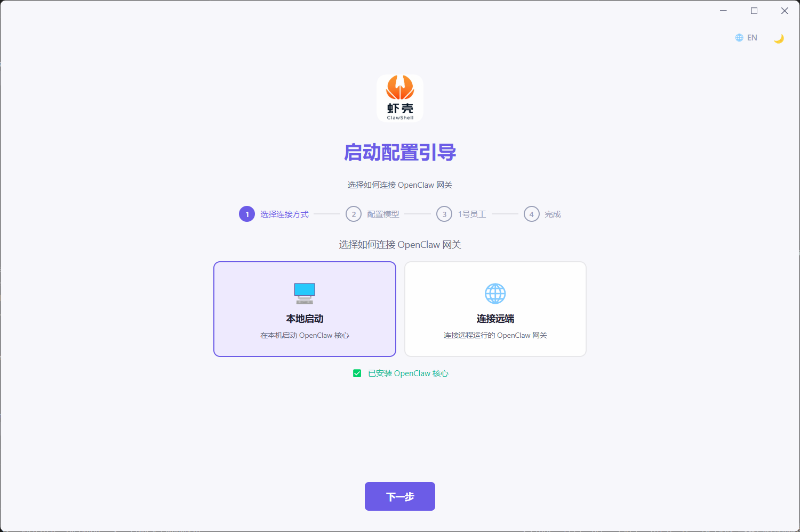</td>
    <td>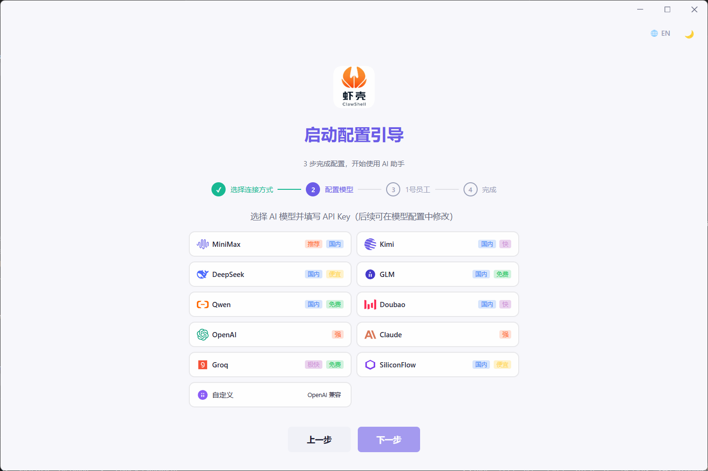</td>
  </tr>
  <tr>
    <td align="center"><b>启动引导-1号助手</b></td>
    <td align="center"><b>启动引导-启动网关</b></td>
  </tr>
  <tr>
    <td>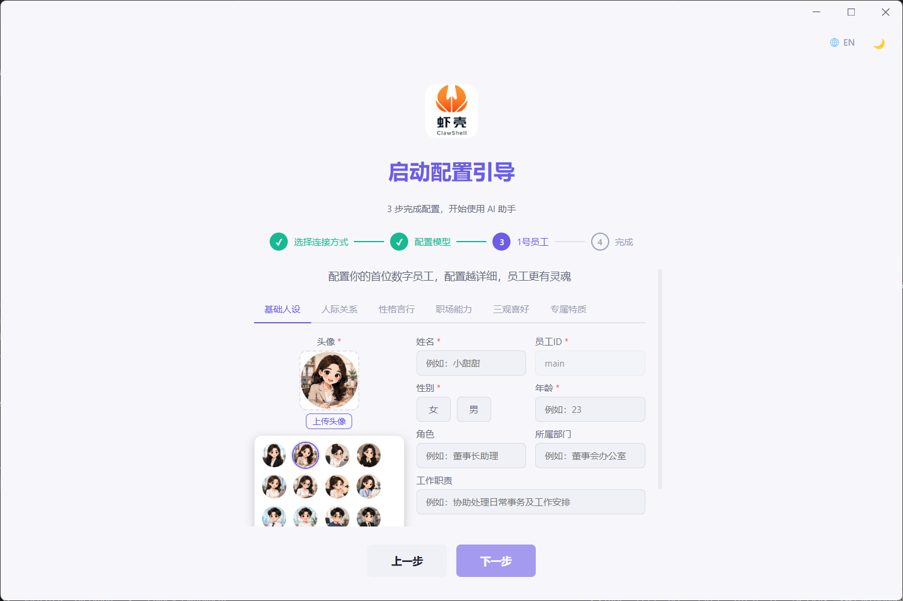</td>
    <td>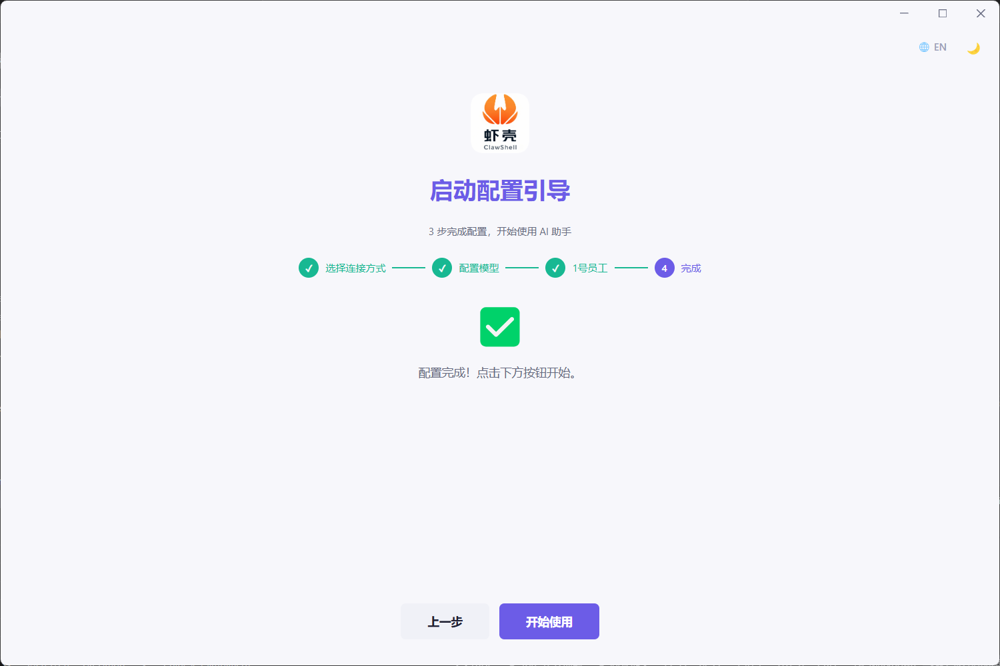</td>
  </tr>
  <tr>
    <td align="center"><b>智能对话</b></td>
    <td align="center"><b>沉浸模式</b></td>
  </tr>
  <tr>
    <td>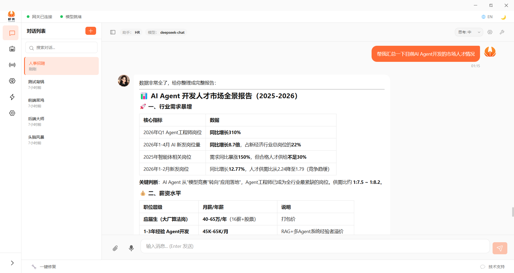</td>
    <td>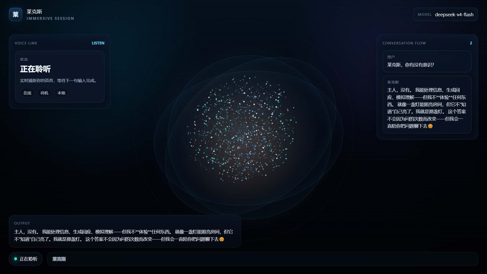</td>
  </tr>
  <tr>
    <td align="center"><b>助手管理</b></td>
    <td align="center"><b>渠道接入</b></td>
  </tr>
  <tr>
    <td>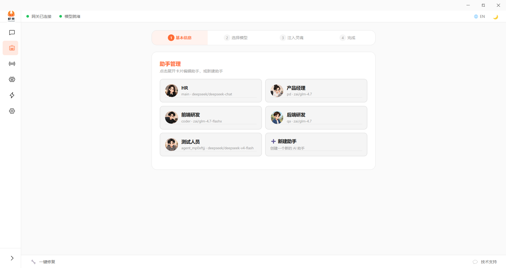</td>
    <td>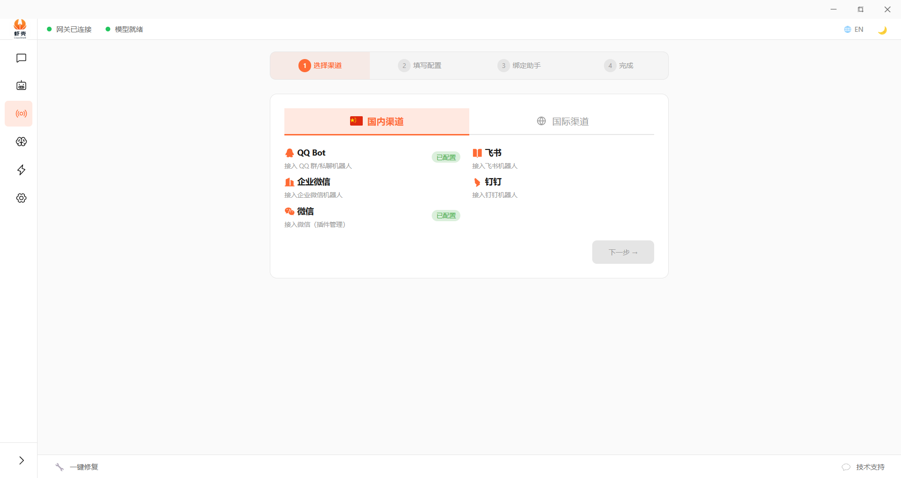</td>
  </tr>
  <tr>
    <td align="center"><b>技能商店</b></td>
    <td align="center"><b>系统设置</b></td>
  </tr>
  <tr>
    <td>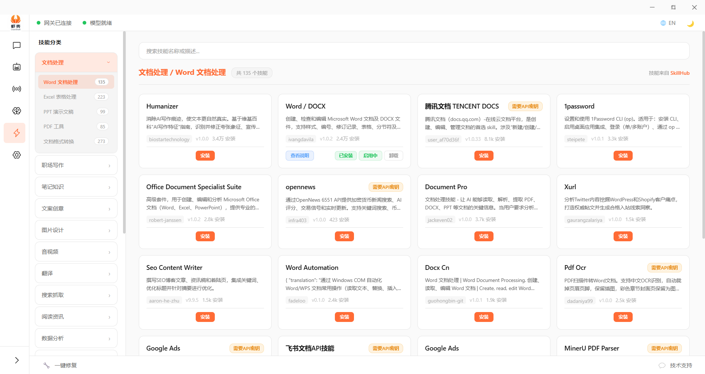</td>
    <td>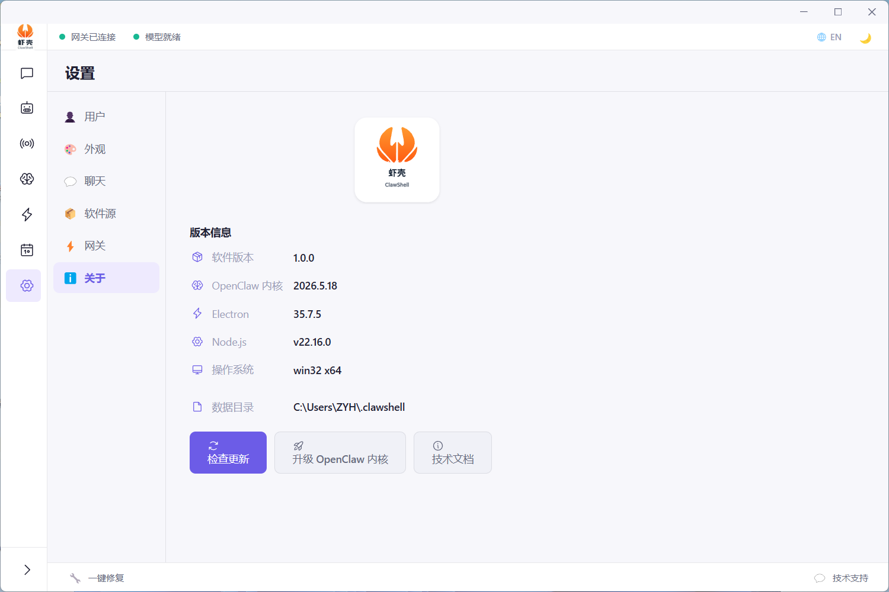</td>
  </tr>
  <tr>
    <td align="center"><b>OpenClaw 核心管理</b></td>
    <td align="center"><b>深色主题</b></td>
  </tr>
  <tr>
    <td>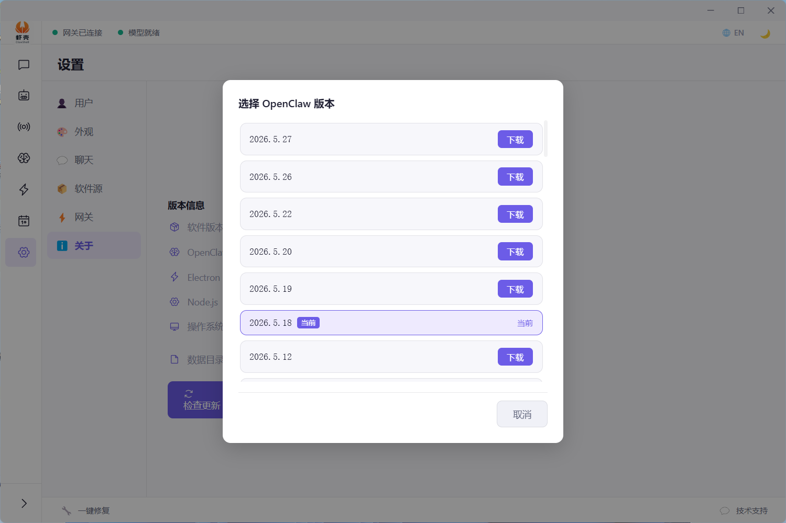</td>
    <td>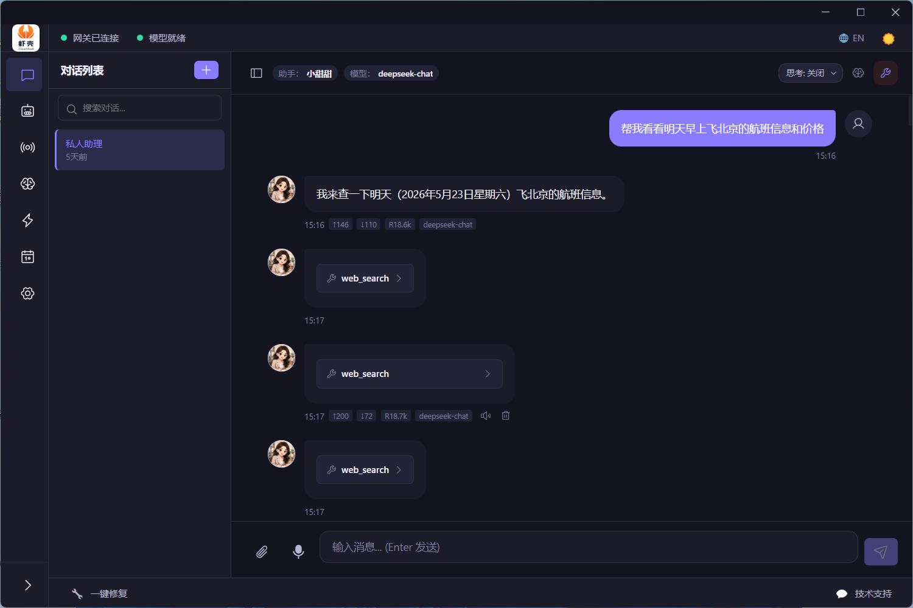</td>
  </tr>
</table>

### 🏗 技术栈

| 层级 | 技术 |
|------|------|
| 桌面框架 | Electron 35+ |
| 前端框架 | Vue 3 (Composition API) + Vite 6 |
| 状态管理 | Pinia |
| 样式方案 | 原生 CSS + CSS Variables（主题系统）|
| 路由 | Vue Router 4 |
| Markdown | markdown-it |
| AI 内核 | [OpenClaw](https://www.npmjs.com/package/openclaw) |
| 构建打包 | electron-builder |

### 🚀 快速开始

#### 环境要求

- Node.js 18+
- npm 或 pnpm

#### 开发模式

```bash
# 克隆仓库
git clone https://github.com/zhouwy1994/clawshell.git
cd clawshell

# 安装依赖
npm install

# 启动开发模式（Vite + Electron）
npm run electron:dev
```

#### 构建打包

```bash
# 构建 Windows 版
npm run build:win

# 构建 macOS 版
npm run build:mac

# 构建 Linux 版
npm run build:linux
```

### 📁 项目结构

```
clawshell/
├── electron/               # Electron 主进程
│   ├── main.js             # 网关生命周期、IPC、窗口管理
│   └── preload.js          # contextBridge IPC 桥接
├── src/                    # Vue 3 渲染进程
│   ├── views/              # 页面组件（Chat、Models、Assistants...）
│   ├── components/         # 可复用组件
│   ├── stores/             # Pinia 状态管理
│   ├── lib/                # 工具库（IPC、图标、语音）
│   ├── i18n/               # 国际化（zh-CN / en）
│   ├── styles/             # 主题与 CSS 变量
│   └── templates/          # 预设助手模板
├── assets/                 # 图标与品牌资源
├── docs/                   # 截图与文档
└── resources/              # 打包用运行时资源
```

### 🤝 参与贡献

欢迎提交 Issue 和 Pull Request！

1. Fork 本仓库
2. 创建功能分支：`git checkout -b feature/my-feature`
3. 提交更改：`git commit -m 'Add my feature'`
4. 推送分支：`git push origin feature/my-feature`
5. 提交 Pull Request

---

## English

### Introduction

ClawShell is a desktop AI assistant client built on the [OpenClaw](https://www.npmjs.com/package/openclaw) engine, designed to bring powerful AI capabilities to everyone. No command-line skills needed — just click and chat with your own AI assistant.Its core highlights include visual configuration of multiple channels, agents, and models, as well as a rich set of preset templates and a skill store to meet various usage scenarios and personalized needs.

### ✨ Features

- **Smart Chat** — Markdown rendering, streaming output, tool call visualization, voice input & TTS
- **Model Configuration** — Support for mainstream AI models (DeepSeek, Kimi, MiniMax, etc.) with a 3-step setup
- **Assistant Management** — Create custom AI assistants with unique personalities; 11 built-in templates
- **Channel Integration** — Connect to 10+ messaging platforms: QQ, WeChat, Feishu, DingTalk, Telegram, Discord, Slack, and more
- **Skill Store** — Browse and install AI skill plugins to extend assistant capabilities
- **Scheduled Jobs** — Visual Cron editor to create and manage AI assistant scheduled tasks with ease
- **Dual-Mode Gateway** — Support both local spawn and remote connection to OpenClaw gateway
- **Core Management** — Install, switch, upgrade, and delete OpenClaw core versions with multi-version coexistence
- **Dark/Light Themes** — Polished dual-theme UI with coral orange brand color
- **Bilingual** — Full i18n support (Chinese & English)
- **One-Click Repair** — Built-in diagnostics and auto-repair

### 🖼 Screenshots

<table>
<tr>
    <td align="center"><b>Startup Guide - Connection Type</b></td>
    <td align="center"><b>Startup Guide - Model Configuration</b></td>
  </tr>
  <tr>
    <td>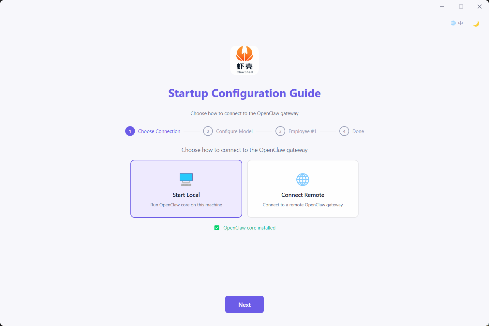</td>
    <td>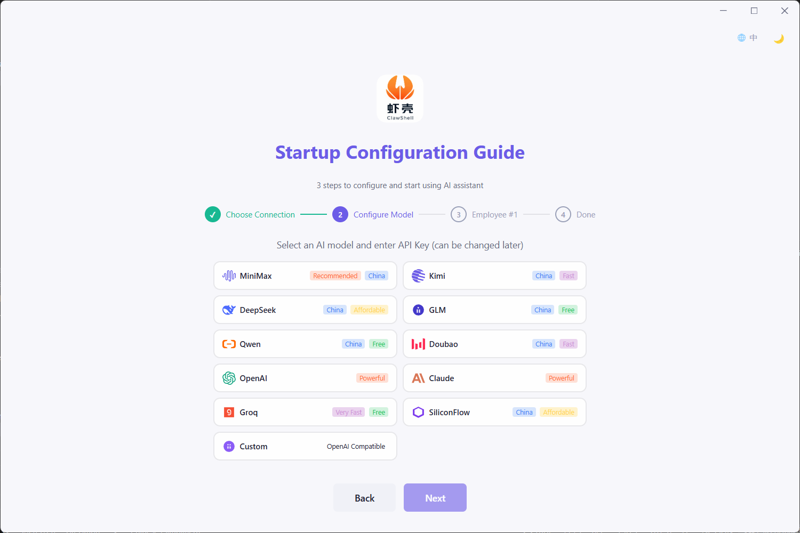</td>
  </tr>
  <tr>
    <td align="center"><b>Startup Guide - First Assistants</b></td>
    <td align="center"><b>Startup Guide - Gateway Start</b></td>
  </tr>
  <tr>
    <td>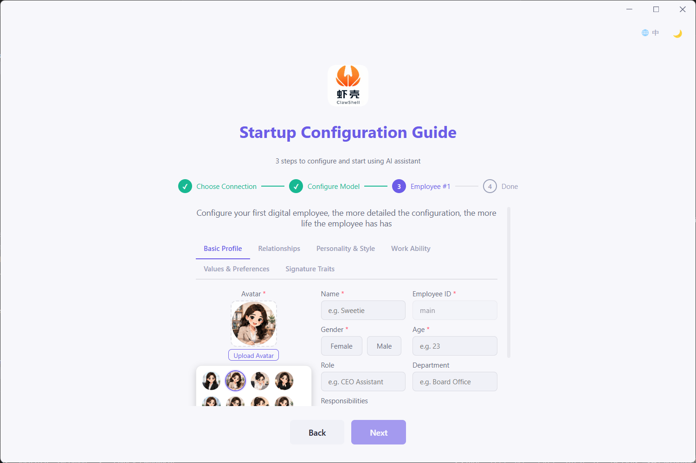</td>
    <td>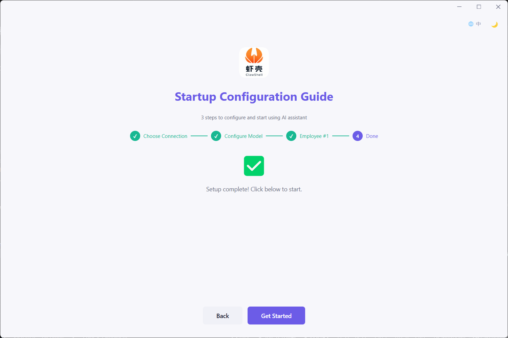</td>
  </tr>
  <tr>
    <td align="center"><b>Chat</b></td>
    <td align="center"><b>Immersive</b></td>
  </tr>
  <tr>
    <td>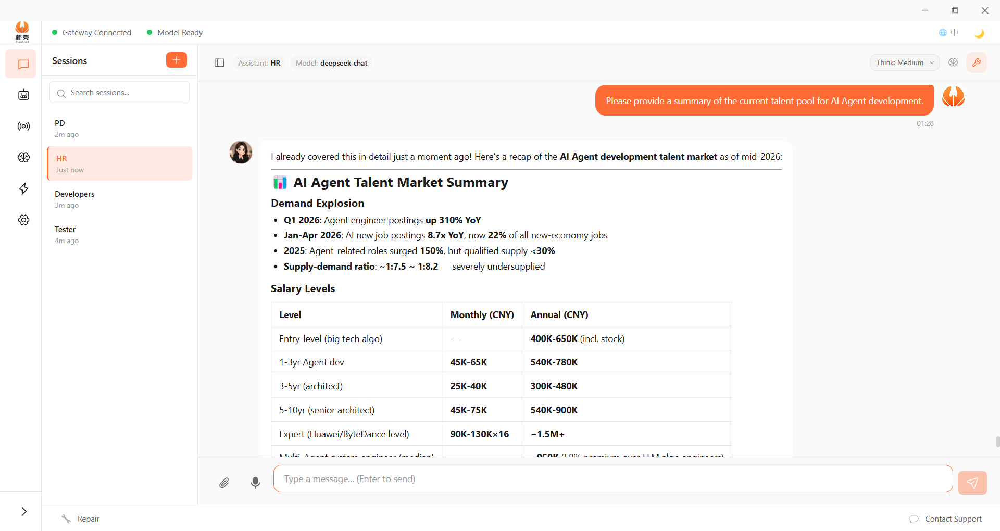</td>
    <td></td>
  </tr>
  <tr>
    <td align="center"><b>Assistants</b></td>
    <td align="center"><b>Channels</b></td>
  </tr>
  <tr>
    <td>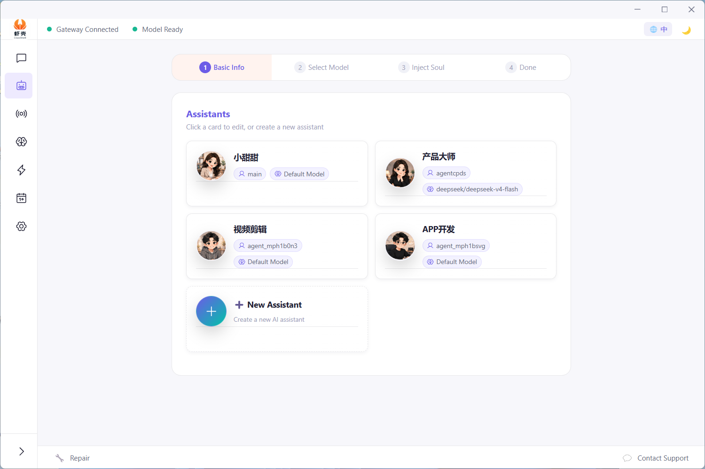</td>
    <td>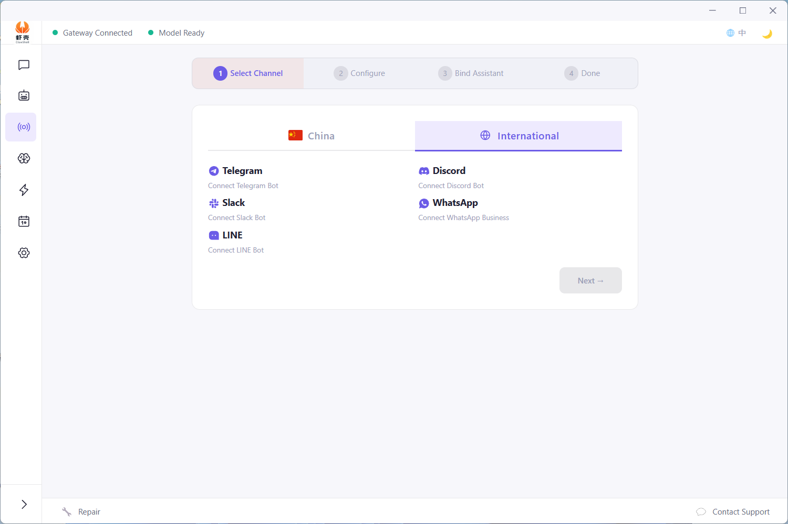</td>
  </tr>
  <tr>
    <td align="center"><b>Skills</b></td>
    <td align="center"><b>Settings</b></td>
  </tr>
  <tr>
    <td>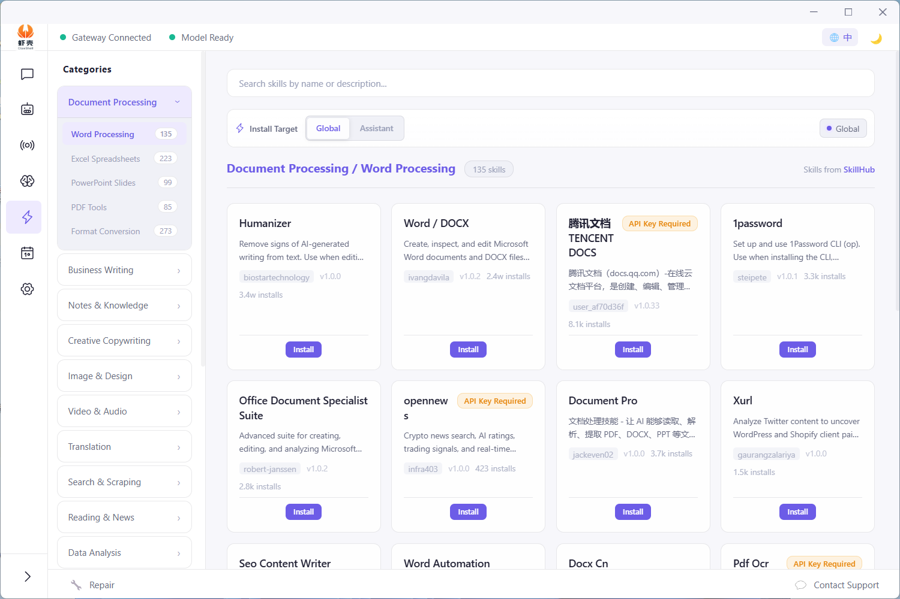</td>
    <td>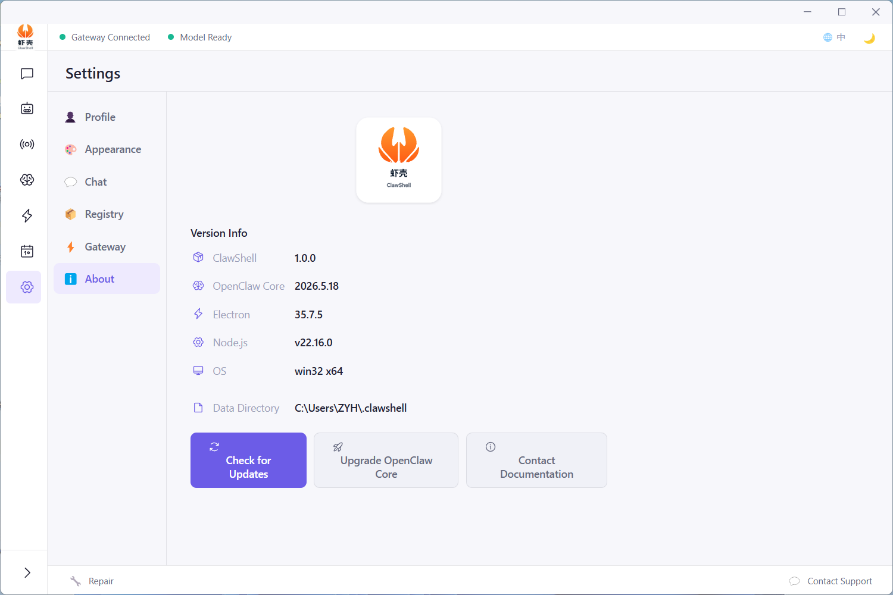</td>
  </tr>
  <tr>
    <td align="center"><b>OpenClaw Core Management</b></td>
    <td align="center"><b>Dark Theme</b></td>
  </tr>
  <tr>
    <td>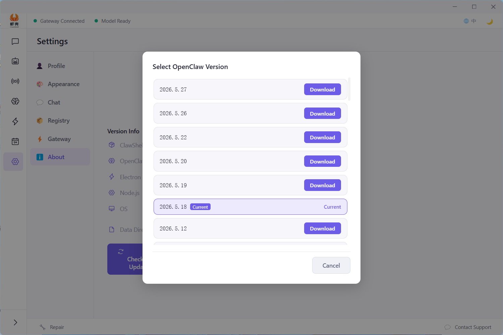</td>
    <td>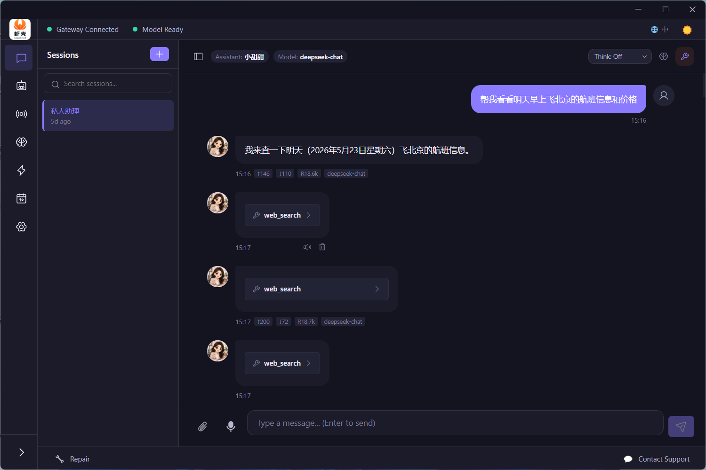</td>
  </tr>
</table>

### 🏗 Tech Stack

| Layer | Technology |
|-------|------------|
| Desktop | Electron 35+ |
| Frontend | Vue 3 (Composition API) + Vite 6 |
| State | Pinia |
| Styling | Native CSS + CSS Variables (theme system) |
| Router | Vue Router 4 |
| Markdown | markdown-it |
| AI Engine | [OpenClaw](https://www.npmjs.com/package/openclaw) |
| Packaging | electron-builder |

### 🚀 Getting Started

#### Prerequisites

- Node.js 18+
- npm or pnpm

#### Development

```bash
# Clone the repository
git clone https://github.com/zhouwy1994/clawshell.git
cd clawshell

# Install dependencies
npm install

# Start dev mode (Vite + Electron)
npm run electron:dev
```

#### Build

```bash
# Build for Windows
npm run build:win

# Build for macOS
npm run build:mac

# Build for Linux
npm run build:linux
```

### 📁 Project Structure

```
clawshell/
├── electron/               # Electron main process
│   ├── main.js             # Gateway lifecycle, IPC, window management
│   └── preload.js          # contextBridge IPC bridge
├── src/                    # Vue 3 renderer
│   ├── views/              # Page components (Chat, Models, Assistants...)
│   ├── components/         # Reusable components
│   ├── stores/             # Pinia state management
│   ├── lib/                # Utilities (IPC, icons, speech)
│   ├── i18n/               # Internationalization (zh-CN / en)
│   ├── styles/             # Themes & CSS variables
│   └── templates/          # Preset assistant templates
├── assets/                 # Icons & brand assets
├── docs/                   # Screenshots & documentation
└── resources/              # Runtime resources for packaging
```

### 🤝 Contributing

Issues and Pull Requests are welcome!

1. Fork this repository
2. Create a feature branch: `git checkout -b feature/my-feature`
3. Commit your changes: `git commit -m 'Add my feature'`
4. Push the branch: `git push origin feature/my-feature`
5. Submit a Pull Request

---

## 📜 开源协议 / License

本项目基于 **AGPL-3.0** 协议开源。
This project is licensed under **AGPL-3.0**.

### 使用限制 / Usage Restrictions

1. 任何使用、修改、部署、分发本项目代码，衍生作品必须完整开源
   All derivative works must be open-sourced.

2. **严禁用于任何商业盈利、付费运营、商业产品集成等商用场景**
   **Strictly forbidden for any commercial profit, paid services, commercial product embedding, and any commercial business scenarios.**

3. 仅支持个人学习、非盈利自用
   Only for personal learning and non-commercial usage.

详见 [LICENSE](LICENSE) 文件。
See the [LICENSE](LICENSE) file for details.

---

<div align="center">

**ClawShell** &copy; 2026 — [pineapple.wang](https://www.pineapple.wang)

</div>
